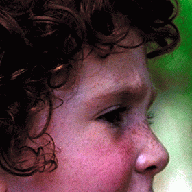
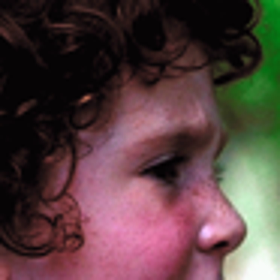
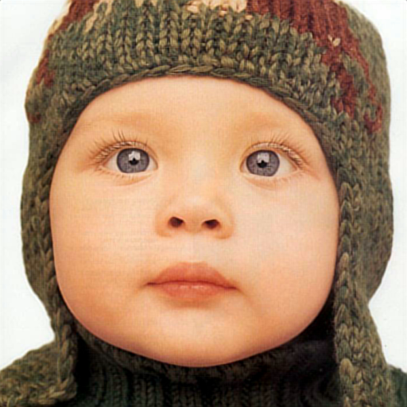
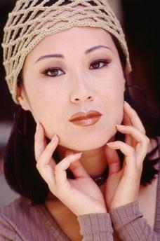
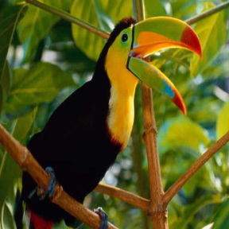
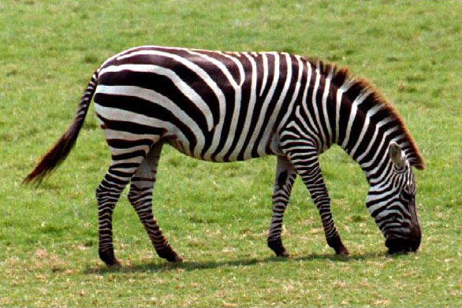
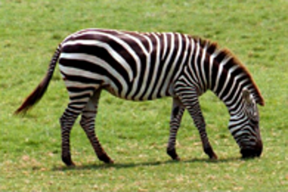
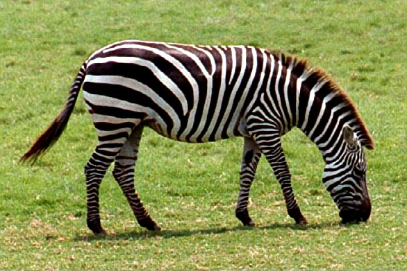
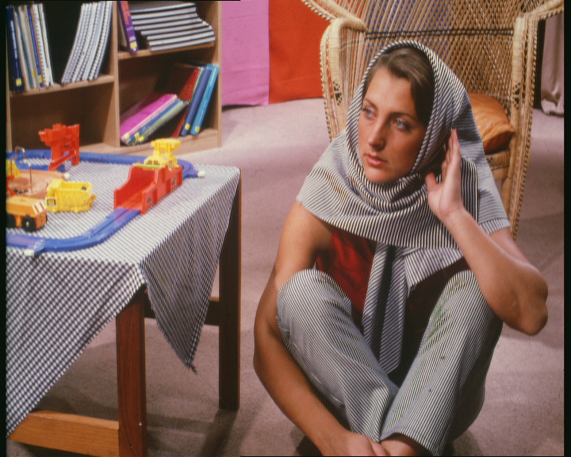
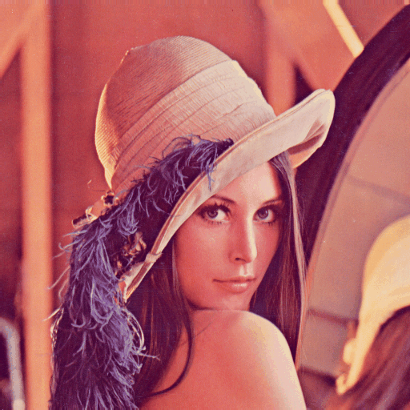

- README em [PT-BR](#PT-BR)
#### PT-BR
# Lumina
Um Upscaler usando IA SRCNN com implementação do Pytorch
## O que é?
Nossa implementação e completamente baseada no [**Papel original**](https://arxiv.org/abs/1501.00092v3) de SRCNN com pequenas mudanças utilizando métodos mais modernos.

- CNN e uma rede neural de convulações onde cada camada analisa, mapeia e refina a imagem e melhora sua nitidez
    * O Modelo utiliza três camadas neurais, onde cada camada tem sua função na construção da imagem em maior resolução, explicação fornecida no código, cada camada possui um Kernel que interpreta a imagem em áreas de tamanho "X", nosso modelo tem kernel de tamanho: **9-1-5** respectivamente
## Como e Treinada?
O modelo e alimentado somente as imagem de alta resolução dentro de uma pasta e automaticamente faz a diminuição artificial de resolução internamente, utiliza filtro GAUSSIAN para borrar a imagem e a recorta em pedaços para melhora do aprendizado\
 *Outros métodos e valores são discutidos no próprio código, qualquer duvida utilizar discussão* 

## Como rodar localmente?
Simples, baixe o arquivo modelo.py e coloque dentro de uma pasta, junto com o arquivo modelo.py crie outra pasta chamada Database(ou qualquer nome de preferencia) e coloque a pasta contendo as imagens de alta resolução para teste.
### Criando primeiro modelo
- linha 22: `continuar` mude para **False**
- linha 23: `image_dir` mude o caminho para caminho feito
- linha 32: `epochs` Loops feitos, comece com valores baixos para teste (Ex. 1000)
- linha 33: `scale` mude para **2** ou valor de escala desejada
- linha 41-42: Troque `f"Set14 scale:{scale}"` para o nome da sua pasta contendo a imagem
### Continuar o treino por onde parou
- linha 22: `continuar` mude para **True**
> [!CAUTION]
> Verifique se o caminho na linha 41-42 esta correto

## Resultado
#### Set5
|      *Modelo*     | *Escala* | *PSNR* | *SSIM* |
| :---------------- | :------: | :-----: |  :---: |
|   **Original**    |    3x    | 32.75dB | 0.9090 |
| **SRCNN-Pytorch** |    3x    | 37.53dB | 0.9857 |

#### Set14
|      *Modelo*     | *Escala* | *PSNR*  | *SSIM* |
| :---------------- | :------: | :-----: |  :---: |
|   **Original**    |    3x    | 29.30dB | 0.8215 |
| **SRCNN-Pytorch** |    3x    | 32.06dB | 0.9118 |

### Exemplos
* **Ground Truth** e imagem original de alta resolução, para comparação
* **Bicúbico** método usado para baixa a resolução da imagem, imagem usada para recriar a de alta resolução na IA
* **SRCNN** Utilizando o modelo SRCNN para aumentar a imagem Bicúbica
#### Set5
|                Ground Truth                 |                Bicúbico x3                 |                 SRCNN x3                 |
| :-----------------------------------------: | :----------------------------------------: | :--------------------------------------: |
|   |   |   |
|                                             |         **PSNR 22.69dB**        |      **PSNR 29.26dB**         |
|          |        |        |
|                                             |         **PSNR 31.66dB**        |      **PSNR 35.50dB**         |
|          |        |        |
|                                             |         **PSNR 32.61dB**        |      **PSNR 38.62dB**         |
|         |       |       |
|                                             |         **PSNR 27.21dB**        |      **PSNR 33.85dB**         |
|          |        |        |
|                                             |         **PSNR 31.14dB**        |      **PSNR 38.98dB**         |

#### Set14
|                Ground Truth                 |                Bicúbico x3                 |                 SRCNN x3                 |
| :-----------------------------------------: | :----------------------------------------: | :--------------------------------------: |
|        |      |      |
|                                             |         **PSNR 25.37dB**        |       **PSNR 31.24dB**        |
|         |       |       |
|                                             |         **PSNR 22.58dB**        |       **PSNR 31.25dB**        |
|      |    |    |
|                                             |         **PSNR 24.88dB**        |       **PSNR 31.66dB**        |
|        |      |      |
|                                             |         **PSNR 21.80dB**        |       **PSNR 27.79dB**        |
|        |      |      |
|                                             |         **PSNR 30.33dB**        |       **PSNR 34.62dB**        |

## Pre-requisitos

* Python 3.13.X
  * Numpy 2.2.6
  * Torch 2.9.1
  * Torchvision 0.24.1
  * Pillow 11.3.0
  * Matplotlib 3.10.8
  * Scikit-image 0.25.2
